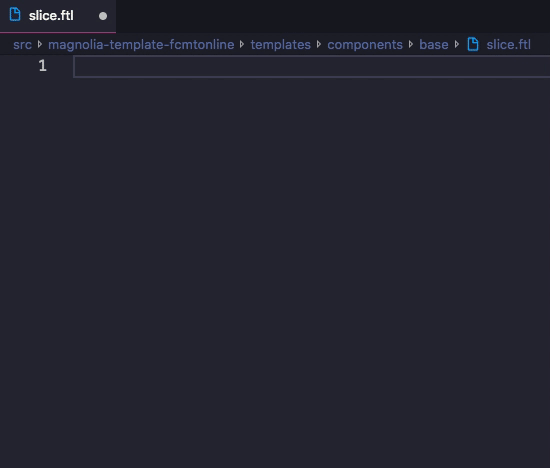

# Magnolia-Freemarker Snippets
These are snippets specific to Freemarker (`.ftl`) files. 



## Jump to... 
__[Freemarker Snippets](#freemarker-snippets)__  
__[HTML Snippets](#html-snippets)__  
__[Magnolia Snippets](#magnolia-snippets)__

&nbsp;
_Note: All output examples below have dummy data, in curly bracket (i.e. `{variableName}`), that represent tab stops, to show you how it should display._

&nbsp;
# Freemarker Snippets
### __include__
```
[#include "{/path/to/include}"] 
```
### __macro:call__
```
[@{macroName} {argument=argumentValue} /]
```
### __macro:define__
```
[#macro {macroName} {arguments=withDefaultValue}] 
  {code}
[/#macro]
```
### __if__
```
[#if {statement}] 
  {code}
[/#if]
```
### __if:has__
```
[#if {statement}?has_content]
  {code}
[/#if]
```
### __if:else__
```
[#if ${1:statement}]
  {code}
[#else]
  {code}
[/#if]
```
### __if:elseif__
```
[#if {statement}]
  {code}
[#elseif {statement2}]
  {code}
[/#if]
```
### __else__
```
[#else]
```
### __elseif__
```
[#elseif {statement}]
```
### __switch__
```
[#switch {variable}]
  [#case {value1}]
    {code}
    [#break]
[/#switch]
```
### __case__
```
[#case {value}]
```
### __break__
```
[#break]
```
### __tag__
```
[#{tagName}]
```
### __/__
```
[/#{tagName}]
```
### __int__
```       
${$0}
```
### __assign__
```
[#assign {nameOfVariable = value}]
```
### __local__
```
[#local {nameOfVariable = value}]
```

&nbsp;
# HTML Snippets
Add a period "`.`" to the end of any html snippet to add a class property (e.g. "`section.`" outputs   `<section class=""></section>`).

Snippet     | Output                
------------|----------------
__section__ | `<section></section>`            
__header__  | `<header></header>`         
__main__    | `<main></main>`            
__div__     | `<div></div>`            
__h1__      | `<h1></h1>`
__h2__      | `<h2></h2>`
__h3__      | `<h3></h3>`
__h4__      | `<h4></h4>`
__p__       | `<p></p>`
__a__       | `<a href="" target="" rel=""></a>`
__img__     | ``
__strong__  | `<strong></strong>`
__class__   | `class=""`
__href__    | `href=""`
__style__   | `style=""`
__role__    | `role=""`
__alt__     | `alt=""`
__title__   | `title=""`
__src__     | `src=""`

&nbsp;
# Magnolia Snippets
### __cmsfn__ 
```
cmsfn.{option}()
```
* __options:__
  1. children
  2. contentByPath
  2. contentById
  2. contentListByTemplateId
  2. page
  2. link
  2. externalLink
  2. externalLinkTitle
  2. linkPrefix
  2. localizedLinks
  2. asContentMap
  2. asJCRNode
  2. asNodeList
  2. ancestors
  2. parent
  2. root
  2. siteRoot
  2. dump
  2. isEditMode
  2. isPreviewMode
  2. isAuthorInstance
  2. isPublicInstance
  2. decode
  2. abbreviateString
  2. queryStringAndFragment
  2. language
  2. wrapForI18n
  2. isCurrentLocale
  2. metaData
  2. fileExtension
  2. readableFileSize 


### __dump__
```
${cmsfn.dump()}
```
### __components__ 
```
[#list components as component]
  [@cms.component content=component /]
[/#list]
```
### __area__ 
```
[@cms.area name="{areaName}" /]
```
&nbsp;

# Release Notes  

### v1.1.2
Updates README with better documentation and adds demo.

### v1.1.1
Fixes switch statement last tab stop.

### v1.1.0
Adds the switch, case, break, and elseif snippets.
